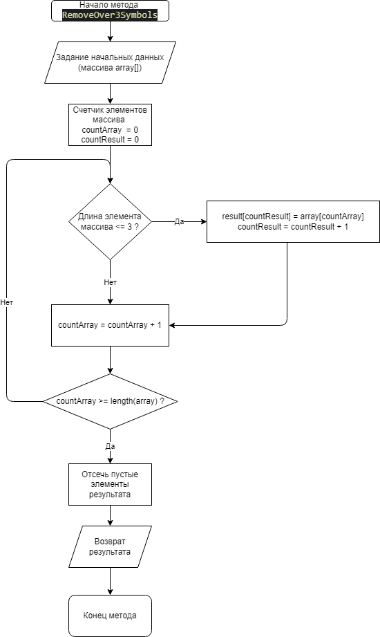
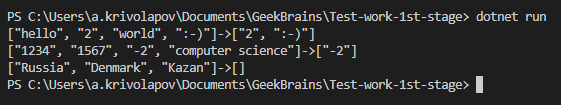
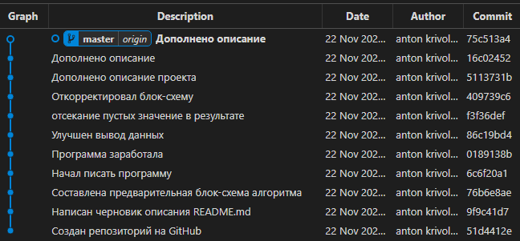

# Итоговая проверочная работа

Итоговая проверочная работа для проверки знаний и навыков по итогу прохождения первого блока обучения на программе разработчик

## Автор

Антон Криволапов akrivola@ya.ru

## Репозиторий на GitHub

https://github.com/akrivola/Test-work-1st-stage.git

## Блок-схема алгоритма

## Программа на языке C#

### Задача

Написать программу, которая из имеющегося массива строк формирует массив из строк, длина которых меньше, либо равна 3 символа. Первоначальный массив можно ввести с клавиатуры, либо задать на старте выполнения алгоритма. При решении не рекомендуется пользоваться коллекциями, лучше обойтись исключительно массивами.

### Текст программы
Находится в файле Program.cs

### Описание алгоритма
Первоначальные данные задаются в ходе выполнения программы.

Функция **void printArray(string[] array)** выводит содержимое одномерного массива строк.

Функция **void printDataAndResults(string[] array)** выводит входные данные и результат с помощью функции *printArray*.

Функция **string[] RemoveOver3Symbols(string[] array)** вычисляет результат. Все элементы входного массива перебираются по порядку, если элемент удовлетворяет условию, то он записывается в массив результата. Так как массив результата при создании имеет такой же размер, как и массив входных данных, после проверки всех входных элементов он обрезается до размера, равного количеству элементов, удовлетворяющих условию.

### Данные для тестирования
["hello", "2", "world", ":-)"]

["1234", "1567", "-2", "computer science"]

["Russia", "Denmark", "Kazan"]

### Результат работы программы

## Контроль версий

Применялся, 11 коммитов.

